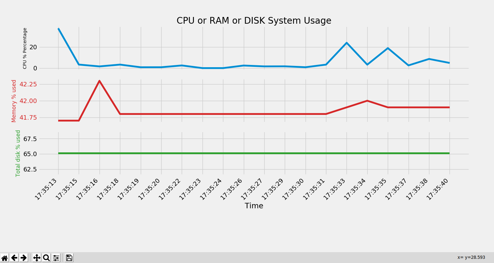

# systemusage
System Usage is Real time graph using python and matplotlib

It all started as challenge to show live CPU usage graph for my computer. I came across certain examples for live ploting with matplot 

I improved the code to give graphs for 3 components in the  basic computer CPU,RAM,Storage DISK.Rigjht know it provides % of used each component seperatly.

# Note:
This is useful for local machines only. If you need to use it for remote systems like via ssh connection it can be possible by useing
  1.  plt.switch_backend('TkAgg') #remote side
  2.  plt.show()#remote side code
  3.  It will foward connection to your local system  via x window 
   for more info [checkzngguvnf.org](https://zngguvnf.org/2018-07-21--matplotlib-on-remote-machine.html)
  

# Prerequisites and libaries used:
[+]Python3

[+]Matplotlib

[+]psutil

[+]datetime


### Installation Steps
```sh
$apt-get install python3
$apt-get install python3-pip
$pip3 install mathplotlib psutil
```
# Running Script:
```sh
 $python3 systemusage.py  ## please do not run in jupyter notebook try to run in terminal itself,it is  working in ubuntu 18.04.
```


for more [styles](https://matplotlib.org/3.1.0/gallery/style_sheets/style_sheets_reference.html)

# So many Tweaks can be done 

I removed x-axis visbility of top two graphs due to overlaping you can check all have the  same x-axis.

# Computer should do what we ask Only


 ## Thanks
  Student of [TomNomNom](https://github.com/TomNomNom)
